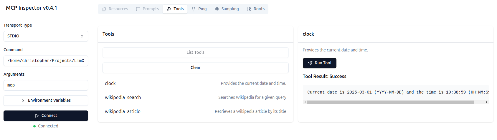

# PHP MCP Demo

Simple demo gluing together [MCP](https://modelcontextprotocol.io/) with Symfony and [LLM Chain](https://github.com/php-llm/llm-chain) - heavily inspired by @lyrixx [MCP blog post](https://jolicode.com/blog/mcp-the-open-protocol-that-turns-llm-chatbots-into-intelligent-agents).

## Requirements

* PHP 8.4
* Composer
* Symfony CLI
* NPX

## Installation

Setting up the Symfony project:

```bash
git clone git@github.com:php-llm/mcp-demo.git
cd mcp-demo
composer install
symfony serve -d --no-tls
```

Running the MCP Inspector:

```bash
npx -y @modelcontextprotocol/inspector
```

## Usage

Open the MCP Inspector in your browser, for example at `http://localhost:5173/`.

For STDIO use:
* Transport Type: `STDIO`
* Command: `/path/to/mcp-demo/bin/console`
* Arguments: `mcp`

For SSE use:
* Transport Type: `SSE`
* URL: `http://localhost:8000/mcp/sse` (port might differ)

Click `Connect` and you should be able to use the tools of the Symfony app via the MCP Inspector.



## SDK

Server integration points for are tailored to Symfony Console and HttpFoundation (Laravel compatible).

### Example Console Command for STDIO

```php
#[AsCommand('mcp', 'Starts an MCP server')]
class McpCommand extends Command
{
    public function __construct(
        private readonly Server $server,
    ) {
        parent::__construct();
    }

    protected function execute(InputInterface $input, OutputInterface $output): int
    {
        $this->server->connect(
            new SymfonyConsoleTransport($input, $output)
        );

        return Command::SUCCESS;
    }
}
```
See [McpCommand.php](src/Command/McpCommand.php) for the full example.

### Example Controller for Server-Sent Events

```php
#[AsController]
#[Route('/mcp', name: 'mcp_')]
final readonly class McpController
{
    public function __construct(
        private Server $server,
        private CachePoolStore $store,
        private UrlGeneratorInterface $urlGenerator,
    ) {
    }

    #[Route('/sse', name: 'sse', methods: ['GET'])]
    public function sse(): StreamedResponse
    {
        $id = Uuid::v4();
        $endpoint = $this->urlGenerator->generate('mcp_messages', ['id' => $id], UrlGeneratorInterface::ABSOLUTE_URL);
        $transport = new StreamTransport($endpoint, $this->store, $id);

        return new StreamedResponse(fn() => $this->server->connect($transport), headers: [
            'Content-Type' => 'text/event-stream',
            'Cache-Control' => 'no-cache',
            'X-Accel-Buffering' => 'no',
        ]);
    }

    #[Route('/messages/{id}', name: 'messages', methods: ['POST'])]
    public function messages(Request $request, Uuid $id): Response
    {
        $this->store->push($id, $request->getContent());

        return new Response();
    }
}
```
See [McpController.php](src/Controller/McpController.php) for the full example.
